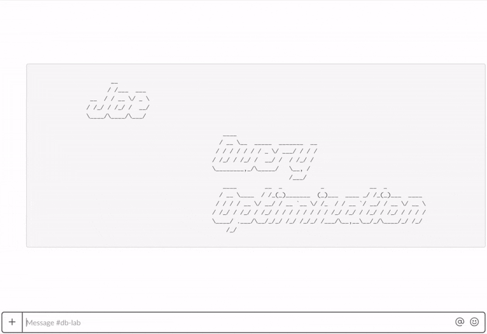

<a href="https://postgres.ai"></a>

# Joe Bot
Query optimization assistant


<div align="center">
	
</div>


## Build & Run

```bash
go build -o bin/joe 
./bin/joe \
  --host="localhost" \
  --dbname="db" \
  --token="xoxb-XXXXXX" \
  --verification-token="XXXXXX"
```


## Set Up a Slack App

In order to use Joe in Slack, you need to configure a new Slack App and add it to your Workspace. Joe Bot should be available with public URL calls from Slack.
1. Create "#db-lab" channel in your Slack Workspace (You can use another channel name)
1. [Create a new Slack App](https://api.slack.com/apps?new_app=1)
    * Use "Joe Bot" as App Name and select a proper Workspace
1. Add Bot User
    * Use "Joe Bot" as Display Name and "joe-bot" as the default username
1. Run Joe Bot with Access Token from "OAuth & Permissions" Feature and Verification Token from "Basic Information" page
1. Enable Incoming Webhooks Feature
    * Press "Add New Webhook to Workspace" and select a previously created channel to post token
1. Enable Event Subscriptions Feature
    * Specify Request URL (URL will be verified by Slack API)
    * Add "app_mention" and "message.channels" to "Subscribe to Bot Events"
1. Invite "Joe Bot" to "#db-lab" channel
